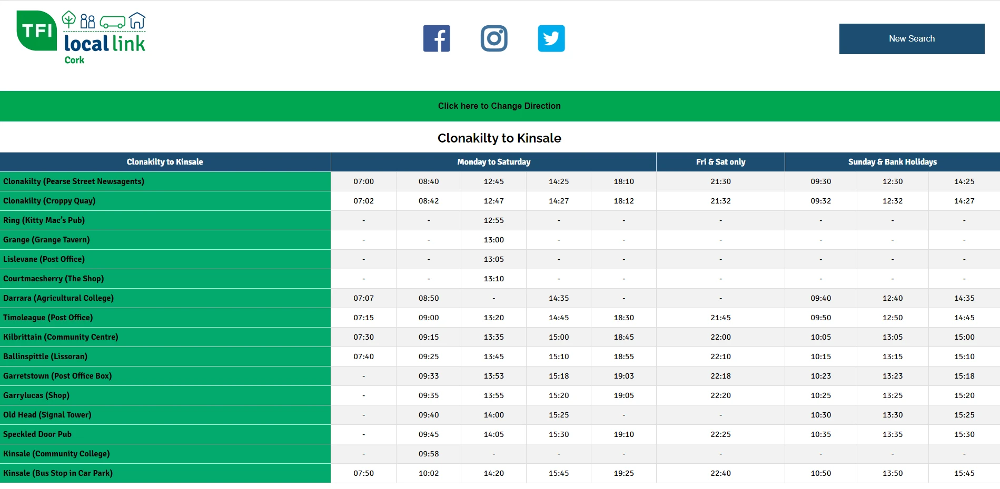
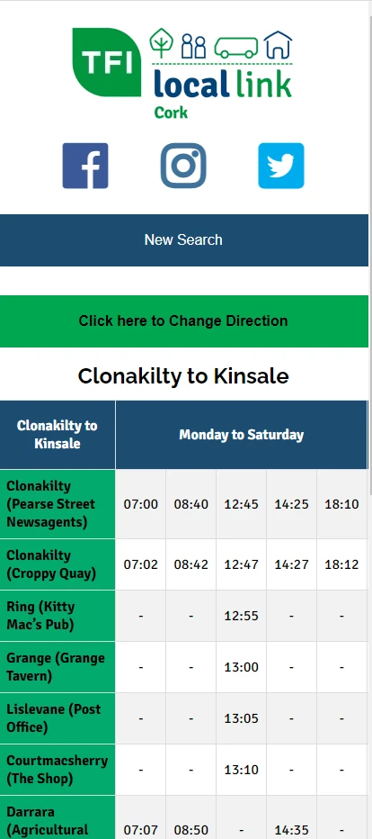
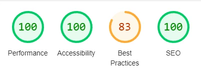
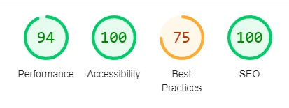
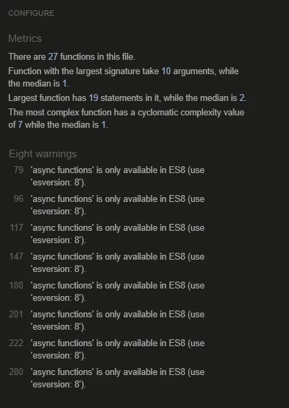

# Fares Calculator 

## Site Goals

Fares Calculator is a site for people to look up Local Link Rural Transport routes in Cork to view timetables and get exact fare costs for their journey.
The site is targetted at people of all ages who are interested in travelling on these routes.   

Fares Calculator is useful for these potential passengers by allowing them to plan for a journey by picking out routes that have suitable pickup and drop points.
As times are published in the timetables they can work out a journey that suits their needs or adjust their schedule to match the pick up times.

The Fares Calculation popup is particularly useful as it spares the potential passenger from trying to work through complicated grids of fare structures that are incomprehensible to the average person. Instead they can pick from a set of select options (calculation parameters) to get an exact fare.

Important Note: At this point there is only one route listed.

Important Note: All references to Local Link are for Local Link Cork only.

# UX/UI & Features

## Design Choices

- A three page website is a preferred minimum to satisfy the user requirement as opposed to a one page scroll.
- Especially as a fourth Search Results page is planned, the required user interaction would make a single page scroll not a sensible approach.
- A simple colour scheme is preferred with lots of white space to present a modern no nonsense site which is uncluttered clear and inviting.
- As the audience will typically access this site from a mobile Phone while on the move, the layout is presented in a Mobile Application Format rather than a more typical website appearance.
- As the target audience is likely to include people with accessibility issues the site is designed to make browsing as simple as possible with very clear instructions.
- The instruction footer on the index.html (landing page) encourages the users to find out more about the available routes and explains clearly how to proceed.
- The navigation is by buttons only without a menu or a hamburger. This is in keeping with the Mobile Application apparoach.
- By clicking Search Now the user is taken to the single.html page (in a future version this will be a Search results page.)
- The single page provides the user with three clear options:
    - Calculate Fares
        This is a popup that allows the user provide us with the necessary parameters to calculate the fare and present it on screen.
    - View Timetables
        This a table presentation of the Stops where the scheduled times can be easily seen.
        On a Mobile device this wide table has a scrolling feature so that the Stops stay fixed.
        The User can also choose to change the direction of travel by clicking the Change Direction button.
    - Download a PDF version of the route.
        On a Mobile device a download notice will typically appear.
        On larger devices typically the user can view the pdf and download using the browser download feature.
        The download PDF button opens in a new tab (future versions will decide this based on a provided accessibilty option as a new tab can be confusing to screen readers etc.)

- There is a New Search button available in the header at all times to enable the user to return to index.html (New Search).
- Using json files allows for this site to dynamically generate pertinent information to a users requirements.

## User Stories

- Users need information in relation to where they can travel with Local Link buses and what services are running close to where they live.
    - This site assists them hugely in that regard. The information a user needs is clearly laid out for them in an easy to navigate website.
- User need to be able to check out what it will cost them to travel on Local Link services.
    - This site will assist users by allowing them to get an accurate calculation of cost.
- Users need to be made aware of developments and news in relation to Local Link activities.
    - This site will assist them as they can see all Facebook, Instagram and Twitter posts by clicking on the social media icons in the header.
- Users need to be able to trust the information given to them.
    - Because this site publishes data directly from json files generated directly from regulated sources, data accuracy is not compromised.
        - Note: The timetable is not produced from json just now but it will be in the next version.
- Users need to be able to find all of their required information in one place.
    - This site presents all of the information they require in an easy to navigate presentation.
        - Note: There is only one route published at present but once the search results feature is in place then all routes will be available.

## Site Navigation
 
- The Logo is featured in the top left corner. This links to the top of the index page called New Search.
- The navigation links are buttons situated to the bottom centre of the page. The other pages are Single (with a Fares Calculation Popup) and Timetable.
- The navigation links are in an attractive and visually clear websafe font which change color on hover to show a contrast.
- The font color of the navigation clearly stands out against a well contrasted background.
- The navigation is really simple with very little scope for confusion.

---- 

## Header

- The branding of the site is consistent as this is the common header used throughout the site and is situated at the top of every page.
- The color scheme is simple using the green and blue from the logo. Social media icons use the appropriate colors.
- The header includes the New Search button which provides a consistent experience for the person browsing the site. 
- The header logo tells the user which Rural Transport entity they are looking at, and that is Local Link as opposed to Bus Eireann. 
- The New Search button indicates to the user that this a site that allows them to search for suitable routes.

----  

## Pages  

### Index Page New Search 

Video

- The video shows a video which promotes Local Link services and provides valuable information on how the service works.  .

Select Route Dropdown List

- The user can select from a list of Local Link Cork routes. (Note: there is only one route visible in this version).

Search Now Button

- The Search Now button navigates the user to the single.html page so they can look at all the details of the selected route.

Instruction

- The instruction assists the user by explaining how the search works. 
- It also serves as a site description.

### Single   Page

Details about the Route selected on index.html page

- There are three buttons each one providing the user with pertinent information about the route
    - Calculate Fares opens a popup which allows the user to calculate the fare based on their provided parameters.
    - View Timetables opens a seperate page timetable.html.
    - Download PDF opens a PDF in a seperate tab.

### Calculate Fares Popup

This is a popup on the single.html page. The user can pick from various parameters to calculate a fare.

- Direction:
    - Are they travelling outbound or Inbound.
- Pickup Point:
    - Where do they intend to catch the bus.
- Destination:
    - Where are they travelling to.
- Passenger:
    - What type of passenger e.g. Adult.
- Ticket:
    - What type of ticket they require e.g. Weekly Ticket.

Calculate Fare button. This when clicked will perform the calculation and present it to the user under "calculate fare is:"

The calculated fare is: The calculated fare is dynamically written to the form.

### Timetable  Page

Change Direction Button. This toggles the direction related timetable schedule from Outbound to Inbound and vice versa.

Clonakilty to Kinsale               |  Kinsale to Clonakilty
:-----------------:|:-----------------:
  |  

Direction Title. This describes the direction being travelled.

Schedule Table. This is the pertinent schedule for the direction being travelled for the previously selected route.
The Schedule table consists of:

- Stops (Pickup/Dropoff points) in the left column. This is a fixed column and does not scroll.
- The other columns show the times.

First column Fixed Pre Scroll              |  First column fixed after scroll
:-----------------:|:-----------------:
  |  

Note: This table will be dynamically created in the next version)

### Download PDF

This is a link to the associated pdf for the previously selected route.

This link opens in a new tab.

The pdf can be viewed or downloaded with the browser download feature.

Note: On mobile, viewing is usually not possible, an option to download is all that is provided.

PDF Page 1              |  PDF Page 2
:-----------------:|:-----------------:
  |  

----

# Testing

## Tests carried out by me.

- This site was tested by me to ensure that all of the pages on this site work in different browsers: Edge, Chrome, Safari and Firefox.
- I checked that the site works in responsive mode on all of these browsers.
- These tests were carried out on all pages of the site.
- The navigation works well on all browsers.

### Header

- The Logo links back to index page when clicked as expected.
- The Social Media icons open in a new tab to the various sites as expected.
- The New Search button takes you back to index page as expected.

Note: Header is fully responsive.

### Index Page

- The iframe youtube video works as expected including youtube controls like fullscreen.
- The Search All Routes Select Dropdown is populated by json correctly and works as expected.
- The Search Now button takes you to single.html as expected.
- The Instruction text is clearly visible

Note: Index Page is fully responsive.

### Single Page

- Calculate fares button opens popup as expected.
- View Timetables button opens timetable page as expected.
- Download PDF opens PDF in new tab as expected.

Note: Single Page is fully responsive.

### Calculate Popup

- The Direction select populates for json as expected.
- The Pickup Point select populates from json as expected.
    - The Pickup select reacts to Direction select as expected.
- The Destination select populates from json as expected.
    - The Destination select reacts to Direction select as expected.
    - The Destination select reacts to Pickup select as expected.
- The Passenger select populates from json as expected.
- The Ticket select populates from json as expected.
- The Calculate fare button runs the javascript calculation as expected.
- The Correct Fare is published in the fare .innerHTML as expected.
- The Try Catch err for Fare Calculate works as expected:
    - Direction Kinsale to Clonakilty
    - Pickup Darrara (Agricultural College)
    - Destination Courtmacsherry (The Shop)

Note: Calculate Popup is fully responsive.

### Timetable Page

- The Change Direction button works as expected toggling the Timetable Table Presented.
- The Route Direction Title toggles as expected.
- The Timetable Table toggles as expected.
- The Timetable Table column one is fixed as expected.
- The Timetable Table columns other than column one scroll as expected on smaller devices.
- The Timetable Table Headings scrolls as one and the heading column 1 is not fixed as expected.

Note: Timetable Page is fully responsive.

### Download PDF

- The download PDF link works and opens in a new tab as expected.

### Javascript Functionality

- All select elements are populating correctly.
- Calculated fares are correct.
- The timetable change direction is working correctly.

## Validator Testing

- HTML:             All pages were passed through the official https://validator.w3.org/ and no errors were found.
- CSS:              All pages were passed through the official https://jigsaw.w3.org/css-validator/ and no errors were found.
- Accessibility:    By running the site pages through Lighthouse in Inspect on Chrome I got the following results:

index desktop                |  index mobile
:-----------------:|:-----------------:
  |  

single desktop               |  single mobile
:-----------------:|:-----------------:
  |  

timetable desktop               |  timetable mobile
:-----------------:|:-----------------:
  |  

- Javscript:        All javascript was passed through the official https://jshint.com/ and no errors were found.
    - jshint did provide these warnings.

     

----

## Development Transition

### Initial Wireframe Concept

index.html                 |  single.html
:-----------------:|:-----------------:
  |  

calculate popup              |  timetable.html
:-----------------:|:-----------------:
  |  

### Data Concept

These Fares excel files are provided by the Local Link Cork timetable and fares management team.

Excel Clonakilty Fares Grid                 |  Excel Kinsale Fares Grid 
:-----------------:|:-----------------:
  |  

These excel files are then Looped through with VBA Code which gathers the data in arrays.

These arrays are then used to create json files like these:

clonfaredata.json                                      |  kinsalefaredata.json
:-----------------------------------------------------:|:----------------------------------------:
 {                                                     | {
   "pick": "1",                                        |   "pick": "21",
   "drop": "2",                                        |   "drop": "22", 
   "adult_single": "2.50",                             |   "adult_single": "2.50",
   "adult_return": "4.00",                             |   "adult_return": "4.00",
   "adult_weekly": "17.50",                            |   "adult_weekly": "17.50",
   "student_single": "1.00",                           |   "student_single": "1.00",
   "student_return": "2.00",                           |   "student_return": "2.00",
   "student_weekly": "9.00",                           |   "student_weekly": "9.00",
   "child_single": "1.00",                             |   "child_single": "1.00",
   "child_return": "2.00",                             |   "child_return": "2.00",
   "child_weekly": "9.00",                             |   "child_weekly": "9.00",
   "ppoint": "Clonakilty (Pearse Street Newsagents)",  |   "ppoint": "Kinsale (Bus Stop in Car Park)"",
   "dpoint": "Clonakilty (Croppy Quay)"                |   "dpoint": "Kinsale (Community College)"
 }                                                     | } 
   
Excel Clonakilty Timetable                 |  Excel Kinsale Timetable
:-----------------:|:-----------------:
  |  

These Timetable excel files are then Looped through with VBA Code which gathers the data in arrays.

These arrays are then used to create json files like these:

clonfaredata.json                                      |  kinsalefaredata.json
:-----------------------------------------------------:|:----------------------------------------:
 {                                                     | {
   "value": "1",                                       |   "value": "21",
   "ppoint": "Clonakilty (Pearse Street Newsagents)"   |   "ppoint": "Kinsale (Bus Stop in Car Park)"
 },                                                    | },
 {                                                     | {
   "value": "2"                                        |   "value": "22"
   "ppoint": "Clonakilty (Croppy Quay)"                |   "ppoint": "Kinsale (Community College)"
 },                                                    | },
   "value": "3",                                       |   "value": "23",
   "ppoint": "Ring (Kitty Mac’s Pub)"                  |   "ppoint": "Speckled Door Pub" 
 },                                                    | }, 

The VBA modules for json creation are in assets/docs/modules_vba 

These json files are then used to populate the select dropdowns on the Calculate Fares popup form.

===============================================================

### How the Calculated Fare works

===============================================================

The user selects whether it is the Outbound Journey or the Inbound Journey in the direction select.

The Pickup select is populated from json to match the direction selected

Clonakilty Pickup                 |  Kinsale Pickup
:-----------------:|:-----------------:
  |  

The Destination select is also populated from json to match the direction selected

Clonakilty Pickup                 |  Kinsale Pickup
:-----------------:|:-----------------:
  |  

Important Note: The first stop is not included, because a passenger cannot be Picked Up and have as the Destination the same stop.

Clonakilty Pickup Stop                |  Clonakilty available Destination Stops
:-----------------:|:-----------------:
  |  

Important Note: A Passenger cannot have a Destination that is earlier than or the same as the Pick Up Point on the route.
The Destination Select responds by only making available Stops that are later than the Pickup stop.

The user can select what passenger type they are like for example "Adult".

The user cans elect what ticket they are looking to purchase like for example "Weekly Ticket".

Passenger                |  Ticket
:-----------------:|:-----------------:
  |  

Then by clicking the Calculate Fares button the correct fare is calculated based on the user selections and the fare is presented on the form.

----

## Bug Fixes
 
### Solved Bugs

- August 28th Problem as index page had a capital letter Index.html.
    - Fix e96c69b2fcd38294c0075cdd66a0dbcddcca3e5a changed to index.html.

- September 1st Problem with json populating Drop Select on Fares Calculation on DOM Load.
    - Fix 8c56c5f7d2a5d92af624c5578bd6dc4aab10ef4f fixed DOM load to populate Drop.

- September 1st Problem when fare is not found in fares json file for given parameters.
    - Fix c63f1f924202060d3a47a30489ee205802aa5629 fixed by adding a Try and Err trap.  

- September 1st Change direction event listener not populating Pick and Drop selects properly.
    - Fix 7cabaa36155e59fed16446a49c6fd3ab3cf9212f fixed event listener code. 

- September 12th Problem with some event listeners firing on pages other than single.
    - Fix 8c687082c717c84a70b63f1eabd4173f4bafb202 fixed with conditional if. 

- September 12th Problem with closing div on pu-container.
    - Fix 07f5f0efd84c0c1947c0dba8dbbcd9bd211a6d5f add in closing div.  

- September 12th Problem with stray tag on New Search button on timetable.html.
    - Fix c6f4f81fdde1768055a3d3ce3221e17a56d076ec remove tag.  

- September 13th Problem Dom loaded not firing select route population by json.
    - Fix 9b331f9e6cf1cad47f8c6608567760b5a5260fdb add in a window load listener. 

- September 13th Select route population by json needs a conditional so it only fires on index.html.
    - Fix 015683d84575d2fe6c69a21553ff0076a890b9b4 add in a conditional if. 

- September 20th Fix error in title iframe on index.html.
    - Fix 4c893f408c664917484bdb347ca265eff02b8729 removed typo. 

### Unfixed Bugs

- No known unfixed bugs

----

## Deployment

### Deployment to GitHub

The site is deployed to GitHub pages. 

- Git status check in Gitpod to ensure all is pushed to GitHub.
- In the GitHub repository under Recent Repositories select [TMartin88/farescalculator](https://github.com/TMartin88/farescalculator)
- Then Settings.
- Then Pages.
- Under Build and Deployment select Deploy from a branch from the Source dropdown list.
- Pick main and then root from the Branch selection area.
- Now GitHub Pages displays a link to the live site.

The live link to the site on GitHub is: [Fares Calculator](https://tmartin88.github.io/farescalculator/)

### Deployment to work domain

This project is also deployed on a live domain for the company I work for part-time. The website on this domain is developed by me in Wordpress using Elementor Pro site builder and Custom Posts (basically each route is a custom post).

The goal of this site is to provide an online search platform which allows interested parties such as passengers to search through all of the Local Link Cork routes.

Fares Calculation is simple for most routes but for some high frequency routes like the 253 it is very complicated and difficult to present in a user friendly way. To make an easy to understand interface for passengers really required something like Javascript so that was the inspiration for me to do this project 2 in the way I did it.

This Project is very useful for Local Link Cork for certain Routes like the 253. The code for fares calculator is the same apart from a few tweaks that are wordpress/elementor specific.

This Fares Calculation element will also be applied to other routes similar to the 253 in the Wordpress implementation.

The link to the site live on a domain is: [253-monday-to-sunday](https://locallinkcork.com/schedule/253-monday-to-sunday/)

----

## Future Features

- To include all routes run by Local Link Cork.
- To allow the user to free type place names in Search and present a matching Search results page.
- To migrate all Excel data to a database.
- To enhance the VBA json generating code to pick up data from database and convert the data to meaningful json.
- To link into Irish Rail and Bus Eireann Fares Calculators.
- To incorporate a QR Code creator to link directly to route urls.
- To put in Extensive Error trapping. 

----

## Performance Improvements

- To get all lighthouse results close to 100%.

----
 
## Credits

### Inspiration

- Working part time with Local Link Cork and in association with Steve Ellis we identified that passengers could not get easy access to our route details.
- Also that the fares rate tables were largly incomprehensible to the regular person.

The challenge is to take data stored in Excel files and bring them to the public.

And so the Fares Calculator was conceived. This project is hopefully just the beginning.

### Content

- Credit for Fetch API to [javascripttutorial](https://www.javascripttutorial.net/javascript-fetch-api/)
- Credit for Filter Array ideas to [w3schools](https://www.w3schools.com/jsref/jsref_filter.asp)

### JSON data

- Thanks to Steve Ellis Operations Co-Ordinator of Local Link Cork for permission to use logo, video, data and pdf.

----

